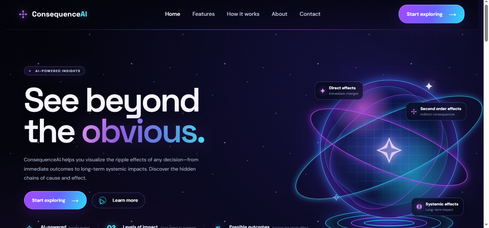
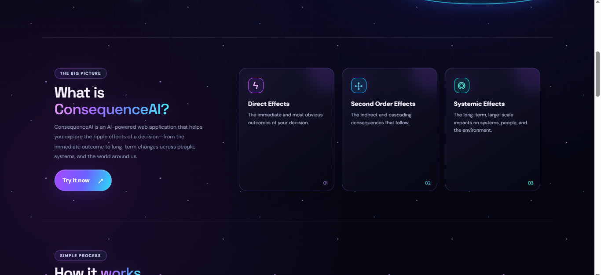
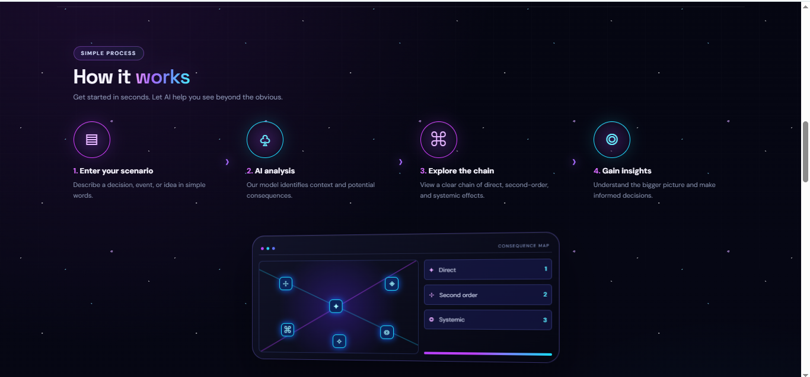
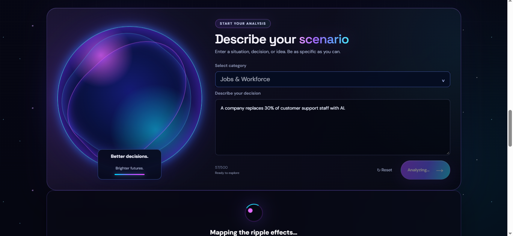
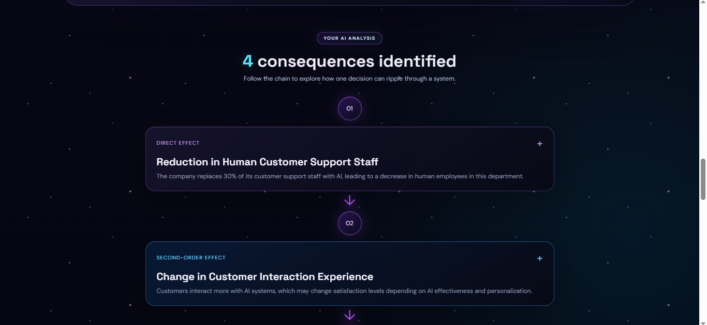
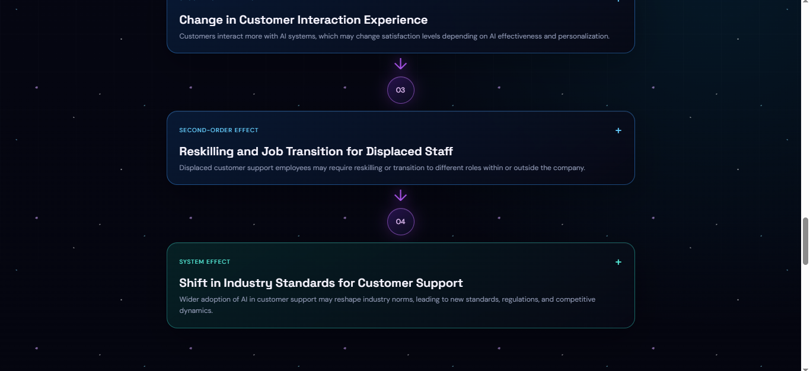

# ConsequenceAI

> Explore the possible consequences of decisions before making them.

ConsequenceAI is an AI-powered web application that analyzes a given scenario and generates a chain of possible consequences, helping users understand how decisions can create direct, second-order, and system-level effects.

## 🚀 Live Demo

https://consequenceai.vercel.app

## 📸 Project Screenshots

### 1. Hero Section



### 2. What is ConsequenceAI?



### 3. How It Works



### 4. Scenario Input



### 5. AI Analysis



### 6. Consequence Results



## 💻 GitHub

https://github.com/bhuvaneshwari-2718/ConsequenceAI

## ✨ Features

- AI-powered scenario analysis
- Category-based analysis
- Direct consequence generation
- Second-order consequence analysis
- System-level consequence analysis
- Impact and likelihood information
- Input validation
- Responsive design
- Premium dark 3D interface
- Secure server-side OpenAI API integration

## 🧠 How It Works

1. Enter a scenario.
2. Select a category.
3. ConsequenceAI sends the scenario to the AI engine.
4. The AI analyzes the chain of consequences.
5. The results are presented as structured consequence cards.

## 🛠️ Technologies Used

### Frontend
- React
- Vite
- JavaScript
- CSS

### AI & API
- OpenAI API
- Serverless API

### Deployment
- Vercel
- GitHub

## 📂 Project Structure

```text
consequence/
├── api/
│   └── consequence.js
├── src/
│   ├── components/
│   ├── services/
│   ├── data/
│   ├── App.jsx
│   └── App.css
├── public/
├── .env
├── .gitignore
├── package.json
└── README.md